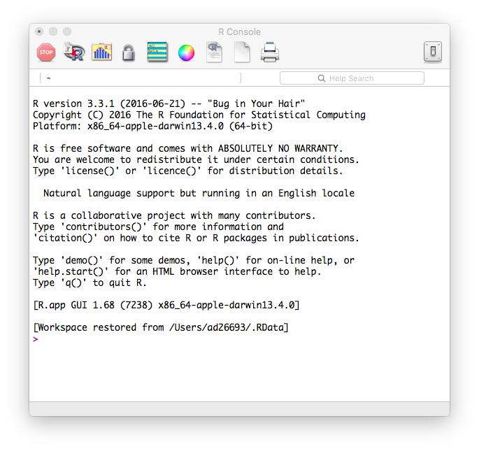
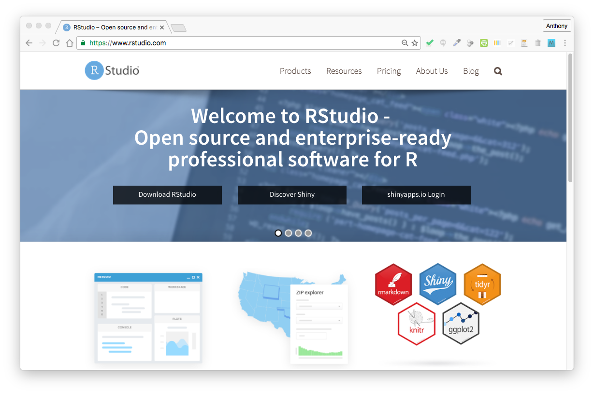
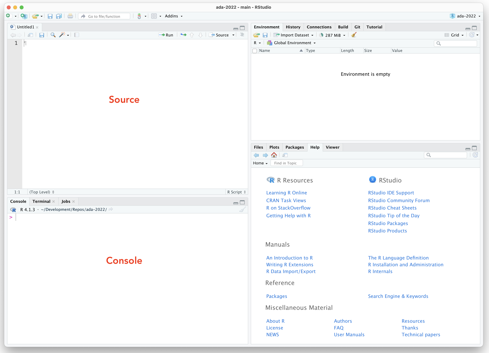

```{r include=FALSE}
source("src/config.R")
```

```
Professor Anthony Di Fiore
Class Meetings: TUE and THU, 3:30-5:00 pm
Student Hours: MON and WED 4:00-5:00 pm and by appointment
```

<br>

```{r echo=FALSE, out.width="80%"}

```

<br>

# Overview {.unnumbered}

```{r echo=FALSE, out.width="40%", out.extra='style="width: 300px; padding-top: 10px; padding-left: 20px; padding-right: 20px; padding-bottom: 10px" align="right"'}
knitr::include_graphics("img/p-values.png")
```

This course provides an overview of methods and tools for applied data analysis. It is geared toward research in biological anthropology and evolutionary biology, but the material covered is applicable to a wide range of natural, social science, and humanities disciplines. Students will receive practical, hands-on training in various data science tools and workflows, including data acquisition and wrangling, exploratory data analysis and visualization, statistical analysis and interpretation, and literate programming and version control.

Statistical topics to be covered include basic descriptive and inferential statistics, hypothesis testing, regression, and linear modeling. Statistical inference will be considered from a frequentist perspective, introducing both parametric and permutation/resampling techniques. If we have time, I will also introduce a Bayesian perspective, although this approach will not be tackled at a particularly advanced level. Additional methods and tools will also be covered based on student interest (e.g., geospatial data analysis, phylogenetic comparative methods, social network analysis, text corpus construction and mining, population genetic analysis) and on how quickly the class feels moving forward.

The course particularly emphasizes the development of data science skills, focusing on the practical side of data manipulation, analysis, and visualization. Students will learn to use the statistical programming language ***R*** as well as other useful software tools (e.g., text editors, shell scripts, databases, query languages, and version control systems).

<hr>

> This class is supported by [DataCamp](https://www.datacamp.com/), an intuitive online learning platform for data science. Learn ***R***, ***Python***, and ***SQL*** the way you learn best, through a combination of short expert videos and hands-on-the-keyboard exercises. Take over 100+ courses by expert instructors on topics such as importing data, data visualization or machine learning and learn faster through immediate and personalised feedback on every exercise.

<hr>

```{r echo=FALSE, out.width="30%"}
knitr::include_graphics("img/DataCamp-50px.png")
```

<!--chapter:end:index.Rmd-->

---
title: "Course Logistics"
---

# (PART\*) Preliminaries {.unnumbered}

# Course Logistics {.unnumbered}

## Learning Objectives {.unnumbered}

By the end of this course, you should:

-   be familiar with **key concepts and methods** in applied data science for acquiring and managing data, conducting exploratory data analyses, testing statistical hypotheses, building models to classify and make predictions about data, and evaluating model performance;
-   have a facility with **modern tools for data analysis**, (e.g., the ***R*** programming environment, version control systems, the Unix command line, web APIs) and be able to apply "best practices" in data science;
-   know how to **interact with both local and remote data sources** to store, query, process, and analyze data presented a variety of common formats (e.g., delimited text files, structured text files, various database systems);
-   be comfortable **writing simple computer programs/scripts** for data management, statistical analysis, visualization, and more specialized applications;
-   know how to design and implement **reproducible data science workflows** that take a project from data acquisition to analysis to presentation and be able to organize your work using a version control system;
-   and be able to apply all of these tools to **questions of interest in the natural and social sciences**.

## Prerequisites {.unnumbered}

At least one semester of introductory statistics is recommended. Prior programming experience is not expected, but would be helpful!

## Texts {.unnumbered}

There are no required texts for this course, but we will be covering useful material from a number of the following books, all of which are excellent resources for learning basic to intermediate level statistics and ***R*** programming.

-   Davies, T.M. (2016). *The Book of R: A First Course in Programming and Statistics.* No Starch Press.
-   Baumer, B.S., Kaplan, D.T., & Horton, N.J. (2017). *Modern Data Science with R.* Chapman & Hall/CRC.
-   Ismay, C. & Kim, A.Y. (2019). *Statistical Inference via Data Science: A ModernDive into R and the Tidyverse.* Chapman & Hall/CRC.
-   Kabacoff, R. (2022). *R in Action: Data Analysis and Graphics with R* (Third Edition). Manning Publications Co.
-   Wickham, H. and Grolemund, G. (2017). *R for Data Science.* O'Reilly Media, Inc.

These are available in print or electronic format directly from the publishers - e.g., [No Starch Press](https://www.nostarch.com/), [O'Reilly Media, Inc.](http://www.oreilly.com/), [Manning Publications Co.](https://www.manning.com/) - or from [Amazon.com](https://www.amazon.com/).

## Other Resources {.unnumbered}

### Cheatsheets {.unnumbered}

-   [Base ***R***](cheatsheets/base-r.pdf)
-   [Advanced ***R***](cheatsheets/advanced-r.pdf)
-   [***R*** Reference Card](cheatsheets/r-reference-card.pdf)
-   [Markdown and ***GitHub*** Flavored Markdown](cheatsheets/markdown-basics.pdf)
-   [RMarkdown 1](cheatsheets/rmarkdown-1.pdf)
-   [RMarkdown 2](cheatsheets/rmarkdown-2.pdf)
-   [RMarkdown Reference Guide](cheatsheets/rmarkdown-reference-guide.pdf)
-   [Learning RMarkdown](cheatsheets/learning-rmarkdown.pdf)
-   [***RStudio*** IDE](cheatsheets/rstudio-ide.pdf)
-   [Data Import](cheatsheets/data-import.pdf)
-   [Data Transformation with {dplyr}](cheatsheets/data-transformation.pdf)
-   [Data Wrangling with {dplyr} and {tidyr}](cheatsheets/data-wrangling.pdf)
-   [Types of Regression (*R in Action* Table 8.1)](cheatsheets/RinActionTable8.1.pdf)
-   [Regression Syntax (*R in Action* Table 8.2)](cheatsheets/RinActionTable8.2.pdf)
-   [Useful Functions for Regression Models (*R in Action* Table 8.3)](cheatsheets/RinActionTable8.3.pdf)
-   [{leaflet} for Interactive Mapping](cheatsheets/leaflet.pdf)
-   [Basics of Probability](cheatsheets/probability.pdf)
-   [{shiny} Tutorial 1](cheatsheets/shiny-tutorial-1.pdf)
-   [{shiny} Tutorial 2](cheatsheets/shiny-tutorial-2.pdf)

### Software Tools {.unnumbered}

#### Programming Languages {.unnumbered}

-   [R](https://cran.r-project.org/) (MacOS, Windows, Linux)
-   [Python](https://www.python.org/) (MacOS, Windows, Linux)
-   [Julia](https://julialang.org/) (MacOS, Windows, Linux)

#### Text Editors {.unnumbered}

-   [Atom](https://atom.io/) (MacOS, Windows)
-   [BB Edit](https://www.barebones.com/products/bbedit/) (MacOS)
-   [Notepad++](https://notepad-plus-plus.org/) (Windows)
-   [Visual Studio Code](https://code.visualstudio.com/) (Window, MacOS, Linux)

#### Markdown Editors {.unnumbered}

-   [MacDown](http://macdown.uranusjr.com/) (MacOS)
-   [MarkdownPad2](http://markdownpad.com/) (Windows)

#### IDEs {.unnumbered}

-   [RStudio](https://www.rstudio.com/) for ***R*** (MacOS, Windows, Linux)

#### Version Control Tools {.unnumbered}

-   [GitHub](https://github.com/) (Website)
-   [GitHub Desktop](https://desktop.github.com/) (MacOS, Windows)

### Web Resources {.unnumbered}

-   [CRAN (Comprehensive R Archive Network)](https://cran.r-project.org/)
-   [DataCamp](https://www.datacamp.com)
-   [Software Carpentry](http://software-carpentry.org/)
-   [Data Carpentry](http://www.datacarpentry.org/)
-   [rOpenSci](https://ropensci.org/)
-   [Stack Overflow](http://stackoverflow.com/)
-   [Online R Exercises](http://r-exercises.com/start-here-to-learn-r/)
-   [R-bloggers](https://www.r-bloggers.com/)
-   [Mockaroo](https://mockaroo.com/)

### Books {.unnumbered}

#### Statistical Modeling in Biology {.unnumbered}

-   Bolker, B.M. (2008). *Ecological Models and Data in R.* Princeton University Press.
-   Irizarry, R.A. & Love, M.I. (2015). *Data Analysis for the Life Sciences.* Lean Publishing.
-   Quinn, G.P. & Keough, M.J. (2002). *Experimental Design and Data Analysis for Biologists.* Cambridge University Press.

#### ***R*** and Basic Statistics {.unnumbered}

-   Caffo, B. (2015). *Statistical Inference for Data Science.* Lean Publishing.
-   Caffo, B. (2016). *Regression Models for Data Science in R.* Lean Publishing.
-   Chihara, L.M. & Hesterberg, T.C. (2018). *Mathematical Statistics with Resampling and R.* John Wiley & Sons, Inc.
-   Crawley, M.J. (2014). *Statistics: An Introduction Using R.* (Second Edition). John Wiley & Sons, Inc.
-   Dalgaard, P. (2008). *Introductory Statistics with R* (Second Edition). Springer.
-   Diez, D., Çetinkaya-Rundel, M., & Barr, C.D. (2019). *OpenIntro Statistics* (Fourth Edition). OpenIntro.org.
-   Irizarry, R.A. (2019). *Introduction to Data Science.* Lean Publishing.
-   Ismay, C. & Kim, A.Y. (2019). *Statistical Inference via Data Science: A ModernDive into R and the Tidyverse.* Chapman & Hall/CRC.
-   James, G., Witten, D., Hastie, T., & Tibshirani, R. (2013). *An Introduction to Statistical Learning.* Springer.
-   Shahbaba, B. (2012). *Biostatistics with R.* Springer.
-   Wolfe, D.A. & Schneider, G. (2017). *Intuitive Introductory Statistics.* Springer.

#### ***R*** Programming {.unnumbered}

-   Davies, T.M. (2016). *The Book of R: A First Course in Programming and Statistics.* No Starch Press.
-   Kabacoff, R. (2022). *R in Action: Data Analysis and Graphics with R* (Third Edition). Manning Publications Co.
-   Matloff, N. (2011). *The Art of R Programming.* No Starch Press.
-   Peng, R. (2016). *R Programming for Data Science.* Lean Publishing.
-   Peng, R. (2016). *Exploratory Data Analysis with R.* Lean Publishing.
-   Wickham, H. (2015). *Advanced R.* Chapman & Hall/CRC.
-   Wickham, H. (2019). *Advanced R.* (Second Edition). Chapman & Hall/CRC.
-   Zuur, A.F., Ieno, E.N., & Meesters, E.H.W.G. (2009). *A Beginner's Guide to R.* Springer.

#### ***R*** Reference {.unnumbered}

-   Adler, J. (2009). *R in a Nutshell.* O'Reilly Media, Inc.
-   Crawley, M.J. (2012). *The R Book* (Second Edition). John Wiley & Sons, Inc.
-   Ekstrøm, C. T. (2016). *The R Primer* (Second Edition). Chapman & Hall/CRC.
-   Gardener, M. (2012). *The Essential R Reference.* John Wiley & Sons, Inc.
-   Teetor, P. (2011). *R Cookbook.* O'Reilly Media, Inc.

#### ***R*** Graphics {.unnumbered}

-   Chang, W. (2013). *R Graphics Cookbook.* O'Reilly Media, Inc.
-   Wickham, H. (2016). *ggplot2: Elegant Graphics for Data Analysis* (Second Edition). Springer.

#### Data Science {.unnumbered}

-   Baumer, B.S., Kaplan, D.T., & Horton, N.J. (2017). *Modern Data Science with R.* Chapman & Hall/CRC.
-   Bruce, P. & Bruce, A. (2017). *Practical Statistics for Data Scientists.* O'Reilly Media, Inc.
-   Cady, F. (2017). *The Data Science Handbook.* John Wiley & Sons, Inc.
-   Grus, J. (2015). *Data Science from Scratch.* O'Reilly Media, Inc.
-   Ismay, C. & Kim, A.Y. (2019). *Statistical Inference via Data Science: A ModernDive into R and the Tidyverse.* Chapman & Hall/CRC.
-   Larose, C.D. & Larose D.T. (2019). *Data Science Using Python and R.* John Wiley & Sons, Inc.
-   Maillund, T. (2016). *Introduction to Data Science and Statistical Programming in R.* Lean Publishing.
-   McNicholas, P.D. & Tait, P.A. (2019). *Data Science with Julia.* Chapman & Hall/CRC.
-   Pearson, R.K. (2018). *Exploratory Data Analysis Using R.* Chapman & Hall/CRC.
-   Peng, R.D. & Matsui, E. (2015). *The Art of Data Science.* Lean Publishing.
-   Wickham, H. & Grolemund, G. (2017). *R for Data Science.* O'Reilly Media, Inc.
-   Williams, G.J. (2017). *The Essentials of Data Science.* Chapman & Hall/CRC.
-   Zumel, N. & Mount, J. (2020). *Practical Data Science with R, Second Edition.* Manning Publications Co.

#### Data Visualization {.unnumbered}

-   Dale, K. (2016). *Data Visualization with Python and JavaScript.* O'Reilly Media, Inc.
-   Healy, K. (2018). *Data Visualization: A Practical Introduction.* Princeton University Press.
-   Thomas, S.A. (2015). *Data Visualization with JavaScript.* No Starch Press.
-   Wilke, C.O. (2019) *Fundamentals of Data Visualization.* O'Reilly Media, Inc.

#### Spatial Data Analysis {.unnumbered}

-   Bivand, R.S., Pebesma, E., & Gómez-Rubio, V. (2013). *Applied Spatial Data Analysis with R* (Second Edition). Springer.
-   Brundson, C. & Comber, L. (2019). *An Introduction to R for Spatial Analysis and Mapping* (Second Edition). SAGE.
-   Brunsdon, C. & Singleton, A.D. (Eds.). (2015). *Geocomputation: A Practical Primer*. Los Angeles: SAGE.
-   Lovelace, R., Nowosad, J., & Muenchow, J. (2019). *Geocomputation with R*. Chapman & Hall/CRC.

#### ***R*** and Bayesian Statistics {.unnumbered}

-   Bolstad, W.M. & Curran, J.M. (2017). *Introduction to Bayesian Statistics* (Third Edition). John Wiley & Sons, Inc.
-   Kruschke, J.K. (2015). *Doing Bayesian Data Analysis: A Tutorial with R, JAGS, and Stan* (Second Edition). Elsevier.
-   McElreath, R. (2019). *Statistical Rethinking: A Bayesian Course with Examples in R and Stan* (Second Edition). Chapman & Hall/CRC.

#### General and Generalized Regression, Mixed Effects, and Multilevel/Hierarchical Modeling {.unnumbered}

-   Burnham, K.P. & Anderson, D.R. (2002). *Model Selection and Multimodel Inference.* Springer.
-   Dunn, P.K. & Smyth, G.K. (2018). *Generalized Linear Models With Examples in R.* Springer.
-   Fox, J. (2016). *Applied Regression Analysis and Generalized Linear Models* (Third Edition). SAGE.
-   Fox, J. & Weisberg, S. (2019). *An R Companion to Applied Regression.* SAGE.
-   Gelman, A. & Hill, J. (2007). *Data Analysis Using Regression and Multilevel/Hierarchical Models.* Cambridge University Press.
-   Hoffman, J.P. (2022). *Linear Regression Models: Applications in R.* Chapman & Hall/CRC.
-   Zuur, A.F., Ieno, E.N., Walker, N.J., Savaliev, A.A., & Smith, G.M. (2009). *Mixed Effects Models and Extensions in Ecology with R.* Springer.

#### Web Scraping, Text Mining, and Text Analysis {.unnumbered}

-   Friedl, J.E.F. (2000). *Mastering Regular Expressions* (Third Edition). O'Reilly Media, Inc.
-   Mitchell, R. (2015). *Web Scraping with Python.* O'Reilly Media, Inc.
-   Nolan, D. & Temple Lang, D. (2014). *XML and Web Technologies for Data Sciences with R.* Springer.
-   Silge, J. & Robinson, D. (2017). *Text Mining with R: A Tidy Approach.* O'Reilly Media, Inc.

#### ***R*** Packages, R Markdown, and Reproducible Research {.unnumbered}

-   Gandrud, C. (2020). *Reproducible Research with R and RStudio* (Third Edition). Chapman & Hall/CRC.
-   Wickham, H. (2015). *R Packages.* O'Reilly Media, Inc.
-   Xie, Y. (2017). *Bookdown: Authoring Books and Technical Documents with RMarkdown.* Chapman & Hall/CRC.
-   Xie, Y., Allaire, J.J., & Grolemund, G. (2018). *R Markdown: The Definitive Guide.* Chapman & Hall/CRC.

#### ***git*** and Unix Shell Tools {.unnumbered}

-   Albing, C., Vossen, J.P., & Newham, C. (2007). *Bash Cookbook.* O'Reilly Media, Inc.
-   Barrett, D.J. (2016). *Linux Pocket Guide: Essential Commands* (Third Edition). O'Reilly Media, Inc.
-   Chacon, S. & Straub, B. (2014). *Pro Git* (Second Edition). Apress.
-   Dougherty, D. & Robbins, A. (1998). *Sed and Awk* (Second Edition). O'Reilly Media, Inc.
-   Newham, C. & Rosenblatt, B. (2005). *Learning the bash Shell* (Third Edition). O'Reilly Media, Inc.
-   Robbins, A. (2006). *UNIX in a Nutshell* (Fourth Edition). O'Reilly Media, Inc.

#### Statistics and Programming in ***Python*** {.unnumbered}

-   Beazley, D. & Jones, B.K. (2013). *Python Cookbook* (Third Edition). O'Reilly Media, Inc.
-   Downey, A.B. (2012). *Think Python.* O'Reilly Media, Inc.
-   Downey, A. (2014). *Think Stats* (Second Edition). O'Reilly Media, Inc.
-   Kazil, J. & Jarmul, K. (2016). *Data Wrangling with Python.* O'Reilly Media, Inc.
-   Lubanovic, B. (2014). *Introducing Python.* O'Reilly Media, Inc.
-   Lee, K.D. (2011). *Python Programming Fundamentals.* Springer.
-   Lutz, M. (2013). *Learning Python* (Fifth Edition). O'Reilly Media, Inc.
-   Lutz, M. (2014). *Python Pocket Reference* (Fifth Edition). O'Reilly Media, Inc.
-   McKinney, W. (2013). *Python for Data Analysis.* O'Reilly Media, Inc.
-   VanderPlas, J. (2016). *Python Data Science Handbook.* O'Reilly Media, Inc.

#### Databases and SQL {.unnumbered}

-   DeBarros, A. (2018). *Practical SQL: A Beginner's Guide to Storytelling with Data.* No Starch Press.
-   Kreibich, J.A. (2010). *Using SQLite.* O'Reilly Media, Inc.
-   Obe, R.O. & Hsu, L.S. (2012). *PostgreSQL: Up and Running.* O'Reilly Media, Inc.
-   Robinson, I., Webber, J., & Eifrem, E. (2015). *Graph Databases* (Second Edition). O'Reilly Media, Inc.

<!--chapter:end:00-course-logistics.Rmd-->

---
title: "Typography and Formatting"
---

# Typography and Formatting {.unnumbered}

To the extent possible, I have tried to follow the following typographic and formatting conventions throughout the course modules.

-   Program names are written in ***bold italics***:

    -   ***R***
    -   ***RStudio***

-   Functions, commands, and ***R*** code are written as `inline code`, e.g., `x <- 5`, or in code blocks:

    ```{r eval = FALSE}
    x <- 5
    print(x)
    ```

-   Package names are written in {curly braces}:

    -   {tidyverse}
    -   {lubridate}

-   Variable names (for vectors, data frames and other tabular data, etc.) are written in **bold**:

    -   **x**
    -   **y**
    -   **airline_flights**

-   Column names within a data frame are written in **bold**, whether referred to separately or as part of the table:

    -   **origin**
    -   **destination**
    -   **airline_flights$origin**
    -   **airline_flights[["destination"]]**

-   Filenames and file types are written in "quotation marks":

    -   "myData.R"
    -   ".csv"

-   Full file path names are written in "quotation marks":

    -   "/Users/Tony/Desktop/myData.R"
    -   "~/Desktop/myData.R"
    -   "C:\Documents and Settings\Anthony Di Fiore\Desktop\myData.R"

-   Directory names are written as `inline code` followed by a slash:

    -   `img/`, `src/`

-   Important concepts are written in *italics* when first referred to:

    -   *working directory*
    -   *environment*
    -   *namespace*

-   Menu names and menu commands are written in **bold**:

    -   **File > New File > R Script**

-   Argument values or values to be replaced are written in lowercase text between \<angle brackets\>, where that entire text, brackets included, should be replaced with the text being asked for:

    -   `setwd("<your working directory>")`
    -   "<your file name>.csv"

-   Constants are written in italics:

    -   *pi*

-   Argument names and assignments are written as inline code:

    -   Set `na.rm=TRUE`
    -   Set `data=df`
    -   Set `filename="~/Users/Tony/Desktop/output.csv"`

-   Names of ***RStudio*** panes are written in **bold**:

    -   **Console**
    -   **Environment/History**

-   Names of ***RStudio*** tabs within panes are written in *italics*:

    -   *History*
    -   *Plots*
    -   *Help*
    -   *Git*

-   Names of dialog boxes are written in *italics*:

    -   *Global Options*

-   Button names and sections within dialog boxes are written in quotation marks:

    -   "OK"
    -   "Cancel"

-   Check box names within dialog boxes are written in `inline code`:

    -   `Restore .RData into workspace at startup`

-   ***R*** object class names are written in **bold**:

    -   **numeric**
    -   **function**

-   ***git*** repository branch names are written as `inline code`:

    -   `main`
    -   `origin/main`

-   Full URLs/links are written in `inline code`:

    -   `https://cran.r-project.org/`
    -   `https://difiore.github.io/ada-2022/`

<!--chapter:end:00-typography-and-formatting.Rmd-->

---
title: "Programming Style Guide"
---

# Programming Style Guide {.unnumbered}

As much as possible, your scripts, programs, and functions should be written in a **consistent** programming style, which makes them easier to read, write, and understand. Some programmers are very opinionated as to what stylistic conventions to follow, and as you become more familiar with ***R*** and more practiced with writing code, you will likely settle on a set that you find particular sensible. I try (not always successfully!) to follow recommendations below, which are largely consistent with those in the much-more-complete [{tidyverse} Style Guide](https://style.tidyverse.org/).

## File Type Conventions {.unnumbered}

-   Use the uppercase ".R" extension for files containing ***R*** code
-   Use the ".RData" extension for files that contain binary data
-   Use the ".Rmd" extension for ***RMarkdown*** documents
-   Use lowercase file extensions for other standard filetypes (e.g., ".csv", ".jpg", ".docx", ".xlsx")

## Stylistic Conventions {.unnumbered}

-   Use a space before and after the standard backwards assignment operator `<-` and other infix operators (except for `=` used in function arguments), but not around parentheses or brackets:

    -   `x <- "Hello"`

-   Even though the syntax is valid, avoid using `=` for assignment, except when assigning values to named arguments in a function:

    -   `rnorm(n=1000, mean=50, sd=10)`

-   Even though the syntax is valid, do not abbreviate `TRUE` and `FALSE` to `T` and `F`

-   Generally avoid using the forward assignment operator `->` except at the end of a sequence of piped operations:

    -   `df <- df %>% filter(age > 50) %>% select(name, age, sex, body_weight)`
    -   `df %>% filter(age > 50) %>% select(name, age, sex, body_weight) -> df`

-   Use a space after a comma when listing the arguments of a function:

    -   `x <- c(4, 5, 6, 7)`
    -   `paste("Data science", "is", "cool", sep=" ")`

## Programming Conventions {.unnumbered}

-   Use simple, single characters for temporary variables, like indices:

    -   `x <- 1:10`
    -   `for (i in 1:100){print(i)}`

-   Whenever possible, use short, descriptive names for variables:

    -   `rate <- 5.6`
    -   `sex <- c("M", "F", "F", "M", "F", "M" "F", "M")`

-   For longer, multi-word variable, function, or argument names, use either *camelCase* or *snake_case*:

    -   `interestRate <- 0.45`
    -   `say_hi <- function(x){print(paste0("Hello, ",x))}`
    -   `print_n_rows <- function(x, n_rows=10){print(x[n_rows,])}`

-   Include *default* values in your function definitions:

    -   `n_rows=10` in the preceding example

-   Include error checking in your functions

-   For support files that contain a single function, name the file to match the name of the function defined in the file:

    -   "prettyPrint.R" for a file that contains the function `prettyPrint()`
    -   "rescale_image.R" for a file that contains the function `rescale_image()`

## Code Formatting Conventions {.unnumbered}

-   Try to keep lines of code to less than 80 characters

-   Use comments liberally to make notes about what you code does

    -   ***R*** ignores lines starting with the hashtag character (`#`) as well as text after this character (until it encounters a line break)

        ```{r}
        # assign `g`, the constant for gravitational acceleration
        g <- 9.80665 # units are m/s^2
        ```

    -   Use a single `#` to introduce a comment, and separate comments from code with a single empty line before the comment:

        ```{r}
        x <- 3
            
        # Now add 2 to x...
        x <- x + 2
        ```

    -   In ***RStudio***, use four dashes `----` at the end of a comment line to indicate a section... this should allow for code folding in your scripts:

        ```{r}
        # Section 1 ----
        x <- 5
        y <- 3
        z <- x + y^2
        ```

> **NOTE:** In ***RStudio***, you can highlight several lines and then use `⌘-SHIFT-C` to comment/uncomment multiple lines simultaneously.

-   Use indentation to identify (nested) blocks of code

    -   Use spaces rather than the invisible tab (`\t`) character for indentation
    -   Use consistent indentation (e.g., 2 spaces, 4 spaces) to keep your code looking neat

```{r echo=FALSE, out.width="80%"}

```

-   Use a *linter* (see under the "Addins" section of the ***RStudio*** toolbar) to catch common style "errors"

> **NOTE:** In ***RStudio***, you can use `⌘-SHIFT-A` within in an ***R*** code block to try to neatly and consistently reformat your code. Also, when working in the text editor in ***RStudio***, holding the option (`⌥`) key while selecting with the cursor allows you to highlight/edit replace text in multiple rows simultaneously.

## Version Control System {.unnumbered}

```{r include=FALSE}
library(emo)
```

-   Finally, always, always, always use a *version control system*!!! `r emo::ji("smiley")` See [**Module 5**](#module-05) and [**Module 6**](#module-06) for more details.

```{r include=FALSE}
detach(package:emo)
```

<!--chapter:end:00-programming-style-guide.Rmd-->

---
title: "Course Schedule"
---

# Course Schedule {.unnumbered}

## Part I - Using ***R*** and ***RStudio*** {.unnumbered}

### An Introduction to ***R*** {.unnumbered}

#### Modules {.unnumbered}

-   Module 01 - [Getting Started with ***R***](#module-01)
-   Module 02 - [Getting Started with ***RStudio***](#module-02)
-   Module 03 - [Extending the Functionality of ***R***](#module-03)
-   Module 04 - [Fundamentals of the ***R*** Language](#module-04)

#### Topics {.unnumbered}

-   History of ***R***

    -   Relation to other languages and statistics software

-   Installing ***R*** and ***RStudio***

-   Using ***R*** and ***RStudio*** in the cloud

-   Setting up your ***RStudio*** workspace

    -   Panels: *Source*, *Console*, *Environment/History*, Other Views

        -   Configuration and customization

    -   Setting the working directory

    -   Saving workspaces

-   ***R*** documentation and getting help

    -   The `?` command
    -   Vignettes
    -   [Stack Overflow](http://stackoverflow.com/)

-   ***R*** Basics

    -   Using ***R*** interactively

    -   Variables and assignment

    -   Packages

        -   Installing and updating

        -   Dependencies

    -   ***R*** objects

        -   Object types - Vectors, simple functions, and environments

        -   Classes and attributes of objects

        -   Scripting and sourcing scripts

#### Suggested Readings {.unnumbered}

-   *Introduction to Data Science*

    -   Chapter 1 - Introduction
    -   Chapter 2 - R Basics

-   *R in Action, Second Edition*

    -   Chapter 1 - Getting Started
    -   Chapter 2 - Creating a Dataset

#### Other Useful Readings {.unnumbered}

-   *The Book of R*

    -   Chapter 1 - Getting Started
    -   Chapter 2 - Numerics, Arithmetic, Assignment, and Vectors

-   *R Programming for Data Science*

    -   Chapter 3 - History and Overview of R
    -   Chapter 5 - R Nuts and Bolts

-   *Statistics: An Introduction Using R*

    -   Chapter 1 - Fundamentals
    -   Appendix: Essentials of the R Language

-   *Advanced R, First Edition*

    -   Chapter 2 - Data Structures

-   *Modern Data Science with R*

    -   Appendix B: An Introduction to R and RStudio

### Version Control and Reproducibility {.unnumbered}

#### Modules {.unnumbered}

-   Module 05 - [Basics of Version Control](#module-05)
-   Module 06 - [Reproducible Research Using ***RStudio***](#module-06)
-   Some recommendations on [Programming Style](#programming-style-guide)

#### Topics {.unnumbered}

-   Good programming practices

    -   Version control with ***git*** and ***GitHub***
    -   Data workflow with ***R*** Projects using local and remote repositories
    -   Reproducible research using **Rmarkdown** and {knitr}
    -   Programming conventions and style

#### Suggested Readings {.unnumbered}

-   *Introduction to Data Science*

    -   Chapter 39 - Git and GitHub
    
-   *Essentials of Data Science*

    -   Chapter 11 - R with Style

#### Other Useful Readings {.unnumbered}

-   [*Happy Git and GitHub for the useR*](https://happygitwithr.com)


-   *Introduction to Data Science*

    -   Chapter 37 - Accessing the terminal and installing Git
    -   Chapter 38 - Organizing with Unix
    -   Chapter 40 - Reproducible projects with RStudio and R Markdown

### Data Science Preliminaries {.unnumbered}

#### Modules {.unnumbered}

-   Module 07 - [Additional Data Structures in ***R***](#module-07)
-   Module 08 - [Getting Data into ***R***](#module-08)

#### Topics {.unnumbered}

-   Working with data

    -   The Tao of text

    -   More object types - matrices, n-dimensional arrays, lists, data frames, and other tabular structures (e.g., data tables and "tibbles")

    -   Subsetting and filtering data structures

        -   Single bracket (`[]`) notation
        -   Double bracket (`[[]]`) notation
        -   `$` notation

    -   Factors

    -   Class coercion and conversion

    -   Special data values - `NA`, `NaN`, `Inf`

    -   Getting data in and out of ***R***

        -   From csv files - {readr}
        -   From Excel - {readxl} and others
        -   From Dropbox - {rdrop2}
        -   From other online resources - {curl}
        -   From databases - {RMySQL}, {RSQLite}, {RPostgreSQL} and others

#### Suggested Readings {.unnumbered}

-   *The Book of R*

    -   Chapter 3 - Matrices and Arrays
    -   Chapter 5 - Lists and Data Frames

-   *R in Action*

    -   Chapter 4 - Basic Data Management

#### Other Useful Readings {.unnumbered}

-   *The Book of R*

    -   Chapter 4 - Non-Numeric Values
    -   Chapter 6 - Special Values, Classes, and Coercion
    -   Chapter 8 - Reading and Writing Files

-   *Advanced R*

    -   Chapter 4 - Subsetting

-   *R for Data Science*

    -   Chapter 8 - Data Import with readr

### Exploratory Data Analysis {.unnumbered}

#### Modules {.unnumbered}

-   Module 09 - [Exploratory Data Analysis](#module-09)

#### Topics {.unnumbered}

-   Summarizing and visualizing data

    -   Basic descriptive statistics
    -   Tidying and reshaping data with {tidyr}
    -   Simple plotting (boxplots, histograms, scatterplots) with {base} ***R***, {ggplot2}, and others

#### Suggested Readings {.unnumbered}

-   *Introduction to Data Science*

    -   Chapter 5 - The tidyverse

-   *R in Action*

    -   Chapter 6 - Basic Graphs
    -   Chapter 7 - Basic Statistics

#### Other Useful Readings {.unnumbered}

-   *The Book of R*

    -   Chapter 13 - Elementary Statistics
    -   Chapter 14 - Basic Data Visualization

-   *R for Data Science*

    -   Chapter 9 - Tidy Data with tidyr

### Data Wrangling and Programming {.unnumbered}

#### Modules {.unnumbered}

-   Module 10 - [Data Wrangling with {dplyr}](#module-10)
-   Module 11 - [Functions and Flow Control](#module-11)

#### Topics {.unnumbered}

-   Manipulating data

    -   {dplyr} functions - `select()`, `filter()`, `arrange()`, `rename()`, `mutate()`, `group_by()`, `summarize()`

    -   Chaining and piping data

-   ***R*** programming practices

    -   Writing functions

        -   Argument lists
        -   Default values

    -   Program flow control

        -   Conditional statements
        -   `for()` loops
        -   `while()` loops

#### Suggested Readings {.unnumbered}

-   *Introduction to Data Science*

    -   Chapter 4 - Programming Basics

#### Other Useful Readings {.unnumbered}

-   *The Book of R*

    -   Chapter 9 - Calling Functions
    -   Chapter 10 - Conditions and Loops
    -   Chapter 11 - Writing Functions

-   *R for Data Science*

    -   Chapter 10 - Relational Data with dplyr

-   *R in Action*

    -   Chapter 5 - Advanced Data Management

## Part II - Statistics and Inference {.unnumbered}

### Location, Spread, and Sampling {.unnumbered}

#### Modules {.unnumbered}

-   Module 12 - [Location, Central Tendency, and Spread](#module-12)

#### Topics {.unnumbered}

-   Populations and samples, parameters and statistics
-   Describing central tendency and variance
-   Standard errors and quantiles

#### Suggested Readings {.unnumbered}

-   *Introduction to Data Science*

    -   Chapter 15 - Random Variables

-   *Statistical Inference via Data Science*

    -   Chapter 7 - Sampling

-   *Modern Data Science with R*

    -   Chapter 7 - Statistical Foundations

#### Other Useful Readings {.unnumbered}

-   *Statistics: An Introduction Using R*

    -   Chapter 13 - Central Tendemcy
    -   Chapter 14 - Variance

-   *R Programming for Data Science*

    -   Chapter 22 - Simulation

### Probability and Distributions {.unnumbered}

#### Modules {.unnumbered}

-   Module 13 - [Probability and Distributions](#module-13)

#### Topics {.unnumbered}

-   Probability and conditional probability

-   Random variables - discrete and continuous

-   Probability mass functions, probability density functions

-   Cumulative probability function

-   Some useful distributions and their properties

    -   Distribution functions

        -   Density (`d`)
        -   Cumulative probability (`p`)
        -   Quantile (`q`)
        -   Random (`r`) functions

    -   Discrete distributions

        -   Bernoulli
        -   Poisson
        -   Binomial

    -   Continuous distributions

        -   Beta
        -   Uniform
        -   Normal

-   Q-Q plots

#### Suggested Readings {.unnumbered}

-   *Introduction to Data Science*

    -   Chapter 14 - Probability

-   *The Book of R*

    -   Chapter 15 - Probability
    -   Chapter 16 - Common Probability Distributions

### Confidence Intervals {.unnumbered}

#### Modules {.unnumbered}

-   Module 14 - [Confidence Intervals](#module-14)

#### Topics {.unnumbered}

-   Standard errors and confidence intervals

    -   CIs based on a theoretical distribution
    -   The Central Limit Theorem
    -   CIs based on bootstrapping
    -   CIs for proportions

#### Suggested Readings {.unnumbered}

-   *Introduction to Data Science*

    -   Chapter 16 - Statistical Inference

-   *The Book of R*

    -   Chapter 17 - Sampling Distributions and Confidence

#### Other Useful Readings {.unnumbered}

-   *Statistical Inference via Data Science*

    -   Chapter 8 - Bootstrapping and Confidence Intervals

### Hypothesis Testing {.unnumbered}

#### Modules {.unnumbered}

-   Module 15 - [Classical Hypothesis Testing](#module-15)
-   Module 16 - [Permutation and Randomization Tests](#module-16)
-   Module 17 - [Error, Power, and Effect Size](#module-17)

#### Topics {.unnumbered}

-   Significance and ***p*** values

-   Classic *Null Hypothesis Significance Testing* (NHST)

    -   One- and two-sample $T$ and $Z$ tests

-   Permutation and randomization Tests

-   Type I and Type II error

-   Statistical power, effect sizes

#### Suggested Readings {.unnumbered}

-   *The Book of R*

    -   Chapter 18 - Hypothesis Testing

-   *Statistical Inference via Data Science*

    -   Chapter 9 - Hypothesis Testing

-   Legendre & Legendre (2012). Chapter 1.2. Statistical testing by permutation. *Numerical Ecology, 3rd Edition.* Elsevier.

#### Other Useful Readings {.unnumbered}

-   *Statistics Done Wrong*

    -   Chapter 1 - An Introduction to Statistical Significance

-   *Statistics: An Introduction Using R*

    -   Chapter 5 - Single Samples
    -   Chapter 6 - Two Samples

#### Relevant Data Camp Material {.unnumbered}

-    *Foundations of Inference* - Introduction to Ideas of Inference
-    *Foundations of Inference* - Confidence Intervals
-    *Foundations of Inference* - Completing a Randomization Test
-    *Foundations of Inference* - Hypothesis Testing Errors

### Introduction to Linear Modeling {.unnumbered}

#### Modules {.unnumbered}

-   Module 18 - [Introduction to Linear Regression](#module-18)

#### Topics {.unnumbered}

-   Correlation and covariation

-   Basic linear modeling

    -   Continuous random predictor and response variables
    -   Simple linear regression (1 predictor and 1 response variable)
    -   Estimating and interpreting regression coefficients
    -   Model I versus Model II regression
    -   The `lm()` function

#### Suggested Readings {.unnumbered}

-   *The Book of R*

    -   Chapter 20 - Simple Linear Regression

#### Other Useful Readings {.unnumbered}

-   *Statistics: An Introduction Using R*

    -   Chapter 7 - Regression

-   *Statistical Inference via Data Science*

    -   Chapter 5 - Basic Regression

#### Relevant Data Camp Material {.unnumbered}

-    *Correlation and Regression in R* - Visualizing Two Variables
-    *Correlation and Regression in R* - Correlation
-    *Correlation and Regression in R* - Simple Linear Regression
-    *Correlation and Regression in R* - Interpreting Regression Models

### Elements of Regression Analysis {.unnumbered}

#### Modules {.unnumbered}

-   Module 19 - [Elements of Regression Analysis](#module-19)

#### Topics {.unnumbered}

-   Inference in regression

    -   Estimating standard errors for regression cofficients
    -   Confidence intervals and prediction intervals
    -   Residuals

-   Model checking

-   Partitioning of variance in linear models

-   Data transformations

#### Suggested Readings {.unnumbered}

-   *Statistical Inference via Data Science*

    -   Chapter 10 - Inference for Regression

#### Other Useful Readings {.unnumbered}

-   Gotelli, N.J. & Ellison, A.M. (2012). Chapter 9. Regression. *A Primer of Ecological Statistics, 2nd Edition.* Sinauer Associates, Inc.

### Extending Linear Regression {.unnumbered}

#### Modules {.unnumbered}

-   Module 20 - [Categorical Data Analysis](#module-20)
-   Module 21 - [Multiple Regression and ANCOVA](#module-21)

#### Topics {.unnumbered}

-   Regression with categorical predictors

    -   One- and multiple-factor ANOVA
    -   Type I, Type II, Type III sums of squares
    -   Interaction plots to visualize changes across groups

-   Simple categorical data analysis

    -   Kruskall-Wallis tests
    -   Chi-Square tests of goodness-of-fit and independence

-   Generating mock data with a defined correlation structure

-   Regression with multiple predictors

    -   More than one continuous predictor
    -   Combinations of continuous and categorical predictors
    -   Visualizing linear models with more than one predictor
    -   Confidence intervals and prediction in multiple regression
    -   Interactions between predictors
    -   Interaction plots to visualize changes across groups

#### Suggested Readings {.unnumbered}

-   *The Book of R*

    -   Chapter 19 - Analysis of Variance
    -   Chapter 21 - Multiple Linear Regression

#### Other Useful Readings {.unnumbered}

-   Gotelli, N.J. & Ellison, A.M. (2012). Chapter 10. The analysis of variance. *A Primer of Ecological Statistics, 2nd Edition.* Sunderland, Sinauer Associates, Inc.

-   *Statistics: An Introduction Using R*

    -   Chapter 8 - Analysis of Variance
    -   Chapter 9 - Analysis of Covariance

### Model Selection {.unnumbered}

#### Modules {.unnumbered}

-   Module 22 - [Model Selection in Linear Regression](#module-22)

#### Topics {.unnumbered}

-   Model simplification and selection

    -   Partial F tests for comparing models
    -   Forward and backward selection
    -   Information criteria considerations for comparing models

-   The Akaike Information Criterion (AIC) and others

    -   {stats} `step()`
    -   {MASS} `stepwise()`
    -   {AICcmodavg}

#### Suggested Readings {.unnumbered}

-   *The Book of R*

    -   Chapter 22 - Linear Model Selection and Diagnostics

#### Other Useful Readings {.unnumbered}

-   Package descriptions for {AICcmodavg} and {MuMIn}

#### Relevant Data Camp Material {.unnumbered}

-    *Correlation and Regression in R* - Model Fit

### Linear and Mixed Effects Modeling {.unnumbered}

#### Modules {.unnumbered}

-   Module 23 - [Generalized Linear Models](#module-23)
-   Module 24 - [Mixed Effects or Multilevel Modeling](#module-24)

#### Topics {.unnumbered}

-   Generalized linear models

    -   Other response variables types (e.g., counts, binary responses)
    -   Logistic regression, multiple logistic regression
    -   Log-linear modeling
    -   Likelihood ratio tests

-   Introduction to mixed effects modeling

    -   Combining fixed and random factors

-   Assessing model fit for GLMs and mixed models

#### Suggested Readings {.unnumbered}

-   *R in Action*

    -   Chapter 13 - Generalized Linear Models

-   Bolker, B.M., Brooks, M.E., Clark, C.J., Geange, S.W., Poulsen, J.R., Stevens, M.H.H., White, & J.-S.S. (2008) Generalized linear mixed models: A practical guide for ecology and evolution. *Trends in Ecology and Evolution* 24: 127-135.

#### Other Useful Readings {.unnumbered}

-   *Statistics: An Introduction Using R*

    -   Chapter 12 - Other Response Variables

-   Bolker, B.M. (2008). Chapter 9. Standard statistics revisited. In: *Ecological Models and Data in R.* Princeton, NJ: Princeton University Press.

-   Quinn, G.P. & Keough, M.J. (2002). Chapter 13. Generalized linear models and logistic regression. *Experimental Design and Data Analysis for Biologists.* Cambridge, UK: Cambridge University Press.

## Part III - Miscellany {.unnumbered}

### [Building Custom ***R*** Packages](#building-r-packages) {.unnumbered .unlisted}

#### Suggested Readings {.unnumbered}

-   *R in Action*

    -   Chapter 21 - Creating a Package

#### Other Useful Resources {.unnumbered}

-   [Hadley Wickham's Definitive Guide to ***R*** Packages](http://r-pkgs.had.co.nz/)
-   [Karl Broman's ***R*** Package Primer](https://kbroman.org/pkg_primer/)
-   [Hilary Parker's ***R*** Package Tutorial](https://hilaryparker.com/2014/04/29/writing-an-r-package-from-scratch/)
-   [Fong Chun's Making your First ***R*** Package Tutorial](http://tinyheero.github.io/jekyll/update/2015/07/26/making-your-first-R-package.html)
-   [Thomas Westlake's Writing an ***R*** Package from Scratch Tutorial](https://r-mageddon.netlify.com/post/writing-an-r-package-from-scratch/)
-   [Building ***R*** Packages](https://rstats-pkgs.readthedocs.io/en/latest/index.html)

### [Building Interactive Web Apps](#shiny) {.unnumbered .unlisted}

#### Other Useful Resources {.unnumbered}

-   [Learning Shiny Resources from RStudio](http://shiny.rstudio.com/tutorial/)
-   [Zev Ross' Shiny Tutorial](http://zevross.com/blog/2016/04/19/r-powered-web-applications-with-shiny-a-tutorial-and-cheat-sheet-with-40-example-apps/)

<!-- ## Part IV - Possible Future Modules {.unnumbered} -->

<!-- ### [Using ***Python*** with ***R***](#python-from-R.html) {.unnumbered} -->

<!-- <!-- #### Useful Resources {-} -->

<!-- - [{reticulate}: The ***R*** Interface to ***Python***](https://rstudio.github.io/reticulate/) -->

<!-- ### Additional Topics -->

<!-- - [Complete "lm.R" App](shiny-tutorial/lm.R) -->

<!-- ### [A Very Brief Introduction to Bayesian Methods]() -->

<!-- ### [Using APIs and Basics of Text Mining]() -->

<!-- > Using APIs and Basics of Text Mining -->

<!-- - Using APIs ("application programing interfaces") -->

<!--    - Accessing data from Twitter and Facebook -->

<!--    - Tweeting and posting from R -->

<!-- - Text mining basics -->

<!--    - Building a corpus -->

<!--    - Introduction to regular expressions -->

<!--    - Building a document-term matrix -->

<!--    - Term frequency analysis -->

<!--    - Visualizing text data -->

<!-- #### Other Useful Readings {-} -->

<!--    - Williams, G. (2016). Hands-on data science with R - Text Mining. -->

<!--    - Gentry, J. (2014). Twitter client for R. -->

<!--    - Kumar, S., Morstatter, F., and Huan, L. 2014. *Twitter Data Analytics.* New York: Springer. -->

<!--    - Package descriptions for {rtweet}, {RFacebook}, {SocialMediaLab} -->

<!-- #### Cluster Analysis, Classification Trees, and Random Forests -->

<!-- #### Text Mining and Natural Language Processing -->

<!-- #### Social Networks and Visualizations -->

<!-- #### Discriminant Function Analysis -->

<!-- #### Spatial Data and Analysis -->

<!-- #### Working with LIDAR Data and GIS -->

<!-- #### Principal Components Analysis -->

<!---#### Factor Analysis -->

<!-- #### Phylogenetic Comparative Analysis -->

<!-- #### Phylogenetic Tree Construction -->

<!-- #### Interacting with Relationtional/Nonrelational Databases and Query Languages -->

<!-- #### Manipulating and Analyzing DNA Sequence Data -->

<!-- [//]:- Manipulating and analyzing DNA sequence data -->

<!-- [//]:   - Data cleanup -->

<!-- [//]:   - Phylogenetic analysis -->

<!-- [//]:- Manipulating and analyzing genotype data (SNPs, MSATS) -->

<!-- [//]:   - Population genetic analysis -->

<!-- [//]: ### Working with Geospatial Data -->

<!-- [//]: #### Topics {-} -->

<!-- [//]:- **R** as a GIS -->

<!-- [//]:  - Connecting to spatial databases -->

<!-- [//]:  - Raster and vector data types -->

<!-- [//]:  - Visualizing and querying spatial data -->

<!-- [//]:- Coordinate system transformations -->

<!-- [//]: #### Suggested Readings {-} -->

<!-- [//]: #### Other Useful Readings {-} -->

<!-- #### Reshaping, Graphing, and Plotting for Exploratory Data Analysis -->

<!-- - FitBit API -->

<!-- - OCR -->

<!-- Topics -->

<!-- Bayesian vs. frequentist statistics -->

<!-- Basics and Bayes’ Theorem -->

<!-- Priors (when they matter and when they don’t) -->

<!-- Implementing Bayesian (regression) models in R -->

<!-- Using {MCMCglmm} -->

<!-- Burn-in, iterations, and intervals -->

<!-- Model assessment -->

<!-- Implementing Bayesian models in the {rethinking} package framework -->

<!-- More details coming soon! -->

<!-- Required Readings -->

<!-- Ellison, A.M. (1996). An introduction to Bayesian inference for ecological research and environmental decision-making. Ecological Applications 6(4):1036-1046. -->

<!-- Useful but Optional Readings -->

<!-- Hadfield, J. (2016) MCMCglmm Course Notes -->

<!-- Package descriptions for {MCMCglmm} and {rethinking} -->

<!--chapter:end:00-course-schedule.Rmd-->

---
title: "Module 01"
---

# (PART\*) Part I - Using ***R*** and ***RStudio*** {.unnumbered}

# Getting Started with ***R*** {#module-01}

## Objectives

> The goal of this module is to get everyone's computers set up with ***R*** for the semester and to provide background and an introduction to the ***R*** programming language and environment.

## Backstory

The name ***R*** is a nod to the statistical programming language ***S*** (for "Statistics") that inspired its creation. ***S*** was developed at Bell Laboratories by John Chambers and later sold to a small company that further developed it into ***S-Plus***. ***R*** was then developed as an alternative to ***S*** by Ross Ihaka and Robert Gentleman in the Department of Statistics at the University of Aukland, New Zealand.

***R*** is an high-level, interpreted language, like ***Python*** or ***Ruby***, where commands are executed directly and sequentially, without previously compiling a program into machine-language instructions. Each statement is translated, on the fly, into a sequence of subroutines that have already been compiled into machine code.

***R*** is open-source software, meaning that the source code for the program is freely available for anyone to modify, extend, and improve upon. ***R*** is also FREE (!) for anyone to use and distribution. The large and active community of users and developers is one of the reasons that ***R*** has become very popular in academics, science, engineering, and business - any field that requires data analytics. Developers have also built in the capacity for easily making production-quality graphics, making it a great tool for data visualization. There are thus **many** good reasons to learn and use ***R***.

Here are a few of the main ones, in a nutshell:

-   ***R*** is high quality software. It is actively developed by an international community of statisticians and software developers with multiple releases and bug fixes every year.
-   ***R*** is FREE (as in thought). The source code is openly avaialable under the GNU General Public License, which allows others to easily evaluate the quality of the code, contribute new functionality, and quickly fix bugs.
-   ***R*** is FREE (as in beer). Whereas licenses for other statistical software such as ***SAS***, ***SPSS***, or ***Stata*** may cost thousands of dollars, ***R*** is available free of charge.
-   ***R*** is available for multiple platforms. Installers are available for Windows, MacOS, and other Unix based systems and most package are OS agnostic.
-   ***R*** is extremely extensible. If there is a procedure you want to run that is not included in one of the standard packages, it is likely available in one of the thousands of extensions packages that have been developed and are also freely available. You can also use ***R*** to control or interface with external applications, including other programming languages (like ***Python***, ***SQL***, ***C++***, ***NetLogo***), other analysis tools (like GIS software), and databases (like ***MySQL***, ***PostgreSQL***, ***SQLite***, etc). It is also always possible for you to improve ***R*** yourself. You can **literally** do just about anything in ***R***.
-   ***R*** has a vibrant, intelligent, and generous user community. LOTS of resources are available online for learning and troubleshooting (see, for example, the section on ***R*** at the [**Stack Overflow**](http://stackoverflow.com/tags/r/info) website.

***R*** can be run in several ways:

-   Interactively from a console prompt after launching the program from the command line in either a terminal window or command shell.
-   In batch mode, by sourcing commands from an ***R*** script file (which is a simple text file).
-   From within an ***R*** graphical user interface (or GUI) or integrated development envrionment (or IDE), which accommodates both of the above.

We are going to introduce several of these ways of working with ***R***, but the easiest and most convenient is to use an IDE.

## Installing the ***R*** Software

-   Download and install ***R*** from the [**Compehensive R Archive Network (CRAN)**](https://cran.r-project.org/) website. Choose the correct version for your operating system.

```{r echo=FALSE, out.width="80%"}

```

-   If you are using MacOS, you should consider also installing [***XQuartz***](https://www.xquartz.org/), which lets you use the ***X11*** X Windows management software.

```{r echo=FALSE, out.width="80%"}
knitr::include_graphics("img/install-XQuartz.png")
```

-   Open the ***R*** program from wherever you installed it (e.g., in MacOS, double-click on the ***R.app*** application in your Applications folder; on a PC, search for and open the ***Rgui.exe*** application, which should be located somewhere inside your `C:\Program Files\R\R-[version]` folder... you should see the console window and the `>` prompt. Note that your screen may look slightly different from the screenshots below.

Also, note that you can also run ***R*** in a terminal shell (MacOS or Unix) or from the Windows command shell after starting it with the command `r`. Depending on whether you have set your PATH variable to detect the ***R*** executable file, you may or may not need to first navigate into the directory containing the executable file.

-   On MacOS, the default GUI will look as follows:

```{r echo=FALSE, out.width="80%"}

```

-   On Windows, the default GUI (***RGui***) looks like this:

```{r echo=FALSE, out.width="80%"}
knitr::include_graphics("img/RGui-windows.png")
```

## Exploring the ***R*** Console

-   ***R*** can be used as an interactive calculator from the console prompt, either in a GUI or in the shell.

    -   Standard mathematical order of operations applies (PEMDAS - parentheses, exponents, multiplication/division, addition/subtraction).

-   The assignment operator `<-` can be used to assign a value, the results of an operation, or specific code to an *object* (e.g., a variable, a function, a complex data structure).

    -   You can also use `=`, but I prefer to use that **only** to assign values to function *arguments* (more on this later).

-   You can set various *settings* to customize your interactions with ***R***.

    -   To change the standard *prompt*, use the function `options()` with the `prompt` argument: `options(prompt="<prompt text>")`, where you supply, between the quotes, text with what you want the prompt to say.

    -   To list the current *working directory* (the default folder where dialog boxes will open and where files and output will be stored unless otherwise specified), use the function `getwd()`, which has no arguments.

    -   To set the current *working directory*, use the function `setwd("<path>")`, where you supply, between the quotes, the path to the desired directory.

        -   On MacOS, these directory options are also available under the **Misc** menu.
        -   On Windows, you can set the *working directory* with the **Change dir** command under the **File** menu.
        -   In ***RStudio***, the *working directory* can be set under the **Session** menu.

-   Within the active workspace, ***R*** keeps a log of all executed commands, and you can use the *arrow keys* to scroll through this history. In ***RStudio***, this list is accessible in the **History** tab.

-   Commands and code can also be written in a text file or *script* and sent to the console for execution.

    -   In most GUIs/IDEs, you can choose to create a new *script* document from the **File** menu, which opens in a text editor of some kind.
    -   From within the text editor, you can send an individual command to the ***R*** interpreter by positioning your cursor somewhere in the line you want to execute and hitting `⌘-RETURN` (Mac) or either `control-R` (for the default GUI that ships with ***R***) or `control-ENTER` (for the ***RStudio*** GUI) (PC).
    -   To send a set of commands to the console as a *batch*, you can highlight the code lines of code you want to execute and then use these same commands.
    -   You can include comments in your scripts by prefacing them with `#`.
    -   Script files can be saved just like any other type of text file, usually with the ".R" extension by default.

-   To view the names of all of the objects in your current *workspace*, you can use the `ls()` function. In ***RStudio***, these also all appear in the **Environment** tab.

-   To clear objects from your workspace, use the `rm()` function, where an individual object's name or a list of object names can be included as the argument to `rm()`.

-   To remove all objects from your workspace, you can use `rm(list=ls())`.

    -   In this case, you are passing to `rm()` a list consisting of all the objects in the workspace, provided by the `ls()` function.

### CHALLENGE: {.unnumbered}

Fire up ***R*** in your mode of choice (by typing "R" at the console prompt in the **Terminal** in MacOS or from a **cmd** or other shell prompt in Windows) and then practice interacting with the software via the command line and console window.

-   Try doing some math in ***R*** by using it to evaluate the following expressions:

    -   8 + 5
    -   10 - 6 / 2
    -   (10 - 6) / 2
    -   10 \* 5
    -   15 / 5
    -   10 \^ 5
    -   3 \* *pi* (where *pi* is a built-in constant)

```{r}
8 + 5
10 - 6 / 2
(10 - 6) / 2
10 * 5
15 / 5
10 ^ 5
3 * pi
```

-   Try working with assignments:

    -   Assign the number 6 to a variable called **x**.
    -   Assign the number 5 to a variable called **y**.
    -   Assign x \* y to a variable called **z**.
    -   Assign x\^2 to a variable called **x2**.

```{r}
x <- 6
x
y <- 5
y
z <- x * y
z
x2 <- x ^ 2
x2
```

-   Try out some of the built-in functions in ***R***:

    -   Assign the number 10 to a variable called **x**.
    -   Take the natural log of **x** using the `log()` function.
    -   Find the factorial of **x** using the `factorial()` function.
    -   Assign the number 81 to a variable called **y**.
    -   Take the square root of y using the `sqrt()` function.
    -   Assign the number -8.349218 to a variable called **z**.
    -   Use `?round` or `help(round)` to view the help file for the function `round()`.
    -   Round **z** to the 1000ths place.
    -   Use `?abs()` to view the help file for the function `abs()`.
    -   Take the absolute value of **z** \* **y**.

```{r}
x <- 10
log(x)
factorial(x)
y <- 81
sqrt(y)
z <- -8.349218
round(z, digits = 3)
abs(z * y)
```

-   Use the `ls()` function to list the variables currently stored in your active session.

    -   How many do you have?

```{r}
ls()
```

-   Use the command `rm(list=ls())` to clear all the variables you have defined.
-   What happens if you type a function name without including the parentheses?
-   What happens if you type a function with an invalid or missing argument?

<hr>

## Concept Review {.unnumbered}

-   Interacting with ***R*** from the console prompt
-   Variable assignment: `<-`
-   Calling built-in functions: `function(<arguments>)`
-   Accessing ***R*** documentation and help files: `?function` or `help(function)`
-   Workspaces and the working directory: `getwd()`, `setwd()`
-   Listing and removing variables from the environment: `ls()`, `rm()`
-   Accessing the console history

<!--chapter:end:01-module.Rmd-->

---
title: "Module 02"
---

# Getting Started with ***RStudio*** {#module-02}

## Objectives

> The goal of this module is to familiar yourself with the ***RStudio*** Integrated Development Environment (IDE).

## Installing the ***RStudio*** Software

Apart from the GUIs included in the MacOS and Windows installations of ***R***, there are several IDEs that connect to the ***R*** interpreter and provide lots of convenient functionality. One of the most versatile and easy to use (and my favorite) is ***RStudio***.

-   Download and install the [***RStudio***](https://www.rstudio.com/) Integrated Development Environment (IDE)

```{r echo=FALSE, out.width="80%"}

```

-   Open the ***RStudio*** program

The workspace that you see is divided into four separate panes (**Source** and **Console** panes on the left, two customizable panes on the right). You can modify the layout and appearance of the ***RStudio*** IDE to suit your taste by selecting **Preferences** from the **RStudio** menu (MacOS) or by selecting **Global Options** from the **Tools** menu (both MacOS and Windows).

```{r echo=FALSE, out.width="80%"}

```

The **Source** pane is where you work with and edit various file types (e.g., scripts), while the **Console** pane is where you run commands in the ***R*** interpreter and see the results of those commands. The other two customizable panes provide easy access to useful tools and overviews of your interactions with ***R***. For example, the **Environment** tab can be used to view all of the objects in the different environments in your current workspace, the **History** tab shows the log of all of the commands you have sent to the interpreter, and the **Packages** tab provides a convenient interface for installing and loading packages (see below).

Within ***RStudio***, you can change the working directory by going to the **Session** menu and selecting **Set Working Directory**.

### CHALLENGE: {.unnumbered}

Repeat the basic maths CHALLENGE from [**Module 01**](#module-01) using the editor and console in ***RStudio***.

> **NOTE:** In both the base GUI that ships with the ***R*** application and in ***RStudio***, the console supports *code completion*. Pressing `TAB` after starting to type a function or variable name will give you suggestions as to how to complete what you have begun to type. In ***RStudio***, this functionality is present also when you are typing code in the text editor in the **Source** pane. Also helpful in ***RStudio*** are popup windows that accompany code completion that show, for each function, what possible arguments that function can take and their default values.

## Using the ***RStudio*** **Cloud** Server

An alternative (though likely slower!) way to use ***R*** and ***RStudio*** is to run them through a browser from **RStudio's** cloud computing server. To use this approach, visit the [***RStudio Cloud*** website](https://rstudio.cloud/), click the `Get Started` button, and create or sign up for an account.

```{r echo=FALSE, out.width="80%"}

```

You can use a ***Facebook*** or ***GitHub*** account to sign up (I recommend the latter. See [**Module 05**](#module-05) for more info on signing up for and using ***GitHub***) or create a new account that is specifically for ***RStudio Cloud***.

```{r echo=FALSE, out.width="80%"}

```

Once you are signed up, or if you have already done so, you can use your account to log in. Doing so will bring you to the landing page for your ***RStudio Cloud*** account.

```{r echo=FALSE, out.width="80%"}

```

Your account lets you access a sandboxed environment on **RStudio's** servers that contains ***R***, ***RStudio***, any packages you install, your own files, etc., which you are connecting via a web browser. You can effectively use it for development without storing anything on your local machine.

There, if you create a `New Project`, you will set up a new ***R*** project within your account space. Your account space can include multiple projects, each with its own set of associated files.

```{r echo=FALSE, out.width="95%"}

```

## Customizing the ***RStudio*** IDE

If you open either the *Preferences* (MacOS) or *Global Options* (MacOS or PC) dialog box in ***RStudio*** you can customize the setup and functionality of your IDE.

In the *General* section, I recommend the settings shown below, particularly about restoring your last workspace into memory upon startup and about asking if you wish to save the contents of your current workspace upon shutdown.

```{r echo=FALSE, out.width="60%"}

```

Feel free to organize the rest of your setup as you would like. For example, you can change lots of options in the *Code*, *Console*, *Appearance*, and *Pane Layout* sections to set up the IDE as best suits your personal tastes.

```{r echo=FALSE, out.width="60%"}

```

Finally, if you have already installed ***git*** on your computer, go to the *Git/SVN* section and make sure that the checkbox "Enable version control interface for RStudio projects" is selected and that the path to your ***git*** executable is filled. If you have installed ***git*** successfully, this should be filled with something like "/usr/bin/git". If it is not, do not worry... we can set this later after installing and troubleshooting that program.

```{r echo=FALSE, out.width="60%"}

```

<hr>

## Concept Review {.unnumbered}

-   Installing, navigating and customizing the ***RStudio*** IDE
-   Running ***R*** and ***RStudio*** through a browser using ***RStudio Cloud***

<!--chapter:end:02-module.Rmd-->

---
title: "Exercise 01"
---

# (PART\*) Exercises {.unnumbered}

# Send Emails Programmatically {.unnumbered}

## Learning Objectives {.unnumbered}

-   Installing and loading/attaching packages
-   Introducing functions and arguments
-   Introducing the {tidyverse} and the pipe `%>%` operator

> **NOTE:** For both of the approaches below, before using Google's gmail server to send emails, there seems to be a key Gmail account setting that has to be changed from the default value: you have to allow "Less Secure Apps" to use your the Gmail account. Details on this setting and on how to make this change can be found as [this link](https://support.google.com/accounts/answer/6010255?hl=en)

## Version 1: Using the {emayaili} package {.unnumbered}

The {emayili} package makes sending simple text emails very easy.

#### Step 1 {.unnumbered}

- Install the {emayili} and {tidyverse} packages.

We can do this at the console prompt...

```{r eval = FALSE}
install.packages("emayili")
install.packages("tidyverse")

# or to do them together...

install.packages(c("emayili", "tidyverse"))
```

We can also do this by using the package manager in ***RStudio***.

```{r echo=FALSE, out.width="80%"}
knitr::include_graphics("img/install-packages.png")
```

#### Step 2 {.unnumbered}

- Load and attach these packages to the search path so you can call functions they contain.

```{r message = FALSE}
library(emayili)
library(tidyverse)
# Note that we can also use `require()` in lieu of `library()`
```

We can also use the {easypackages} packages to do both of these things... {easypackage} makes installing and loading multiple packages "easy" by introducing the `packages()` and `libaries()` functions.

- First, install and load {easypackages}:

```{r eval = FALSE}
install.packages("easypackages")
library(easypackages)
```

- Then...
 
```{r eval = FALSE}
packages("emayili", "tidyverse")
libraries("emayili", "tidyverse")

# or even...

my_packages <- c("emayili", "tidyverse")
packages(my_packages)
libraries(my_packages)
```

#### Step 3 {.unnumbered}

- Create a new email "message" with the `envelope()` function.

This function takes several intuitive arguments that we can assign values to directly within the function.

```{r}
message <- envelope(
  from = "anthony.difiore@gmail.com",
  to = c("anthony.difiore@gmail.com", "anthony.difiore@austin.utexas.edu"),
  subject = "Sending a message using {emayili}...",
  text = "Hello! This is a plain text message.")
```

> **NOTE:** ***R*** essentially ignores whitespace (spaces and tab characters) and also allows you to run code from one line to the next. It is even pretty forgiving about where you put carriage returns, although it is good form to place them following a "," or before/after a parenthesis or brace.

Using {tidyverse} syntax, we can set up the same email as follows:

```{r}
message <- envelope() %>%
  from("anthony.difiore@gmail.com") %>%
  to(c("anthony.difiore@gmail.com", "anthony.difiore@austin.utexas.edu")) %>%
  subject("Sending a message using {emayili}...") %>%
  text("Hello! This is a plain text message.")
```

The difference here is that we are first creating an empty "message" object and then "piping" that object using `%>%` into different helper functions to create the details of the message.

#### Step 4 {.unnumbered}

- Create an SMTP (or "Simple Mail Transfer Protocol") "server" object with details about how to send a message

```{r}
smtp <- server(
  host = "smtp.gmail.com",
  port = 465,
  username = "anthony.difiore@gmail.com",
  password = "") # add your password between quotation marks here
```

#### Step 5 {.unnumbered}

- Send your message by passing it as an argument to the server object. Then, CHECK YOUR EMAIL to confirm that you receive the message.

```{r eval = FALSE}
smtp(message, verbose = TRUE)

# NOTE: setting verbose = FALSE (or omitting the argument) will suppress output to the console
```

#### Next Steps? {.unnumbered}

Use the ***RStudio*** **Help** tab to browse the documentation associated with the {emayali} package to see how you can customize your message, e.g., by adding `cc` or `bcc` arguments, by using a different "reply to" address, by adding attachments, or by encrypting your message.

## Version 2: Using the {blastula} package {.unnumbered}

The {blastula} package allows us to create and send more complex HTML and markdown-based formatted emails.

Similar to {emayili}, {blastula} provides two main functions: [1] `compose_email()` for constructing various parts of a message and [2] `smtp_send()` for specifying email server settings and passing the message to the server to send. However, {blastula} but also adds in some helper functions that allow you to store credentialing information in either a separate text file that is referenced when you run the function to send a message or in your computer's keychain. {blastula} also stores some default information on commonly-used email providers and services (e.g., on Google's "gmail" and Microsoft's "office365" and "outlook"), which may make configuring the server setup easier than using {emayili}.

#### Step 1 {.unnumbered}

- Install the {blastula} package.

```{r eval = FALSE}
install.packages("blastula")
```

#### Step 2 {.unnumbered}

- Load the {blastula} package.

```{r}
library(blastula)
```

#### Step 3 {.unnumbered}

- Create a new email "message" with the `compose_email()` function.

This function takes several intuitive arguments that we can assign values to directly within the function.

```{r}
# Compose the message
message <- compose_email(
  body = "Hello! This is a simple HTML message."
  )

# Preview the message
# This will open the HTML message in a browser window or in the RStudio Viewer tab
message
```

We can add some formatting to our email by using the `md()` function and markdown syntax. Here, we pipe `%>%` the `body` argument to the `md()` function to convert it to markdown.

```{r}
# Compose the message
message <- compose_email(
  body = "# Hello!\nThis is a simple **HTML** message with some *markdown* syntax." %>% md()
)

# Preview the message
message
```

We can also spice up our email with an image from a local file

```{r}
# Create text as html
text <- "# Hello!\nThis is a simple **HTML** message with some *markdown* syntax... and a cool picture!"

# Create image as html
image <- add_image(
  file = "/Users/ad26693/Development/Repos/ada-2022/img/batnet.jpg",
  width = 300, align = "center"
)

# Compose the message
message <- compose_email(
  body = c(text, image) %>% md()
)

# Preview the message
message
```

#### Step 4 {.unnumbered}

- Create a credentials file.

The following will create a `JSON` text file in your working directory that contains default information for your outgoing mail server, e.g., Google's "gmail" server (`host = "smtp.gmail.com"`, `port = 465`) or Microsoft's Office365 server (`host = "smtp.office365.com"`, `port = 587`), along with your email address and your password. When you run the following lines of code, you will be asked to enter a password, which will be stored in the credentials file:

```{r eval = FALSE}
# gmail credentials file
create_smtp_creds_file(
  file = "my_gmail_creds",
  user = "anthony.difiore@gmail.com",
  provider = "gmail"
)
# show the credentials file
creds_file("my_gmail_creds")

# office365 credentials file
create_smtp_creds_file(
  file = "my_office365_creds",
  user = "anthony.difiore@austin.utexas.edu",
  provider = "office365"
)
# show the credentials file
creds_file("my_office365_creds")
```

> **NOTE**: If you omit the `provider=` argument, you should pass `host=`, `port=`, and `use_ssl=` arguments to the `create_smtp_creds_file()` function.

#### Step 5 {.unnumbered}

- Send the message via STMP using a credentials file.

```{r eval = FALSE}
smtp_send(email = message,
  from = "anthony.difiore@gmail.com",
  to = "anthony.difiore@gmail.com",
  subject = "Sending a message using {blastula} and a credentials file...",
  credentials = creds_file(file = "my_gmail_creds"),
  verbose = TRUE
  # NOTE: As above, setting verbose = FALSE (or omitting the argument) will suppress output to the console
)

# or, using the %>% operator and a different server and credentials file...

message %>% smtp_send(
    from = "anthony.difiore@austin.utexas.edu",
    to = "anthony.difiore@austin.utexas.edu",
    subject = "Sending a message using {blastula} and a credentials file...",
    credentials = creds_file(file = "my_office365_creds")
)
```

#### Step 6 {.unnumbered}

- We can also send the message by specifying our credentials manually within the `smtp_send()` function.

The following will prompt us for our password to send the message:

```{r eval = FALSE}
message %>% smtp_send(
    from = "anthony.difiore@gmail.com",
    to = "anthony.difiore@gmail.com",
    subject = "Sending a message using {blastula} and entering credentials manually...",
    credentials = creds(
      user = "anthony.difiore@gmail.com",
      provider = "gmail"
    )
  )

message %>% smtp_send(
    from = "anthony.difiore@austin.utexas.edu",
    to = "anthony.difiore@austin.utexas.edu",
    subject = "Sending a message using {blastula} and entering credentials manually...",
    credentials = creds(
      user = "anthony.difiore@austin.utexas.edu",
      provider = "office365"
    )
  )
```

#### Optional Next Steps? {.unnumbered}

Again, use the ***RStudio*** **Help** tab to browse the documentation associated with the {blastula} package to see how you can customize your message, e.g., with attachments.

#### Even More Next Steps? {.unnumbered}

Finally, it is a bit more complicated, but note that we can also use the {keyring} package along with {blastula} to set up a credentials "key" in our computer's keychain and refer to that to specify our credentials for sending a message. When you create the keys, you will be asked to provide your password.

```{r eval = FALSE}
install.packages("keyring")
```

```{r}
library(keyring)
```

```{r eval=FALSE}
# Create gmail key
create_smtp_creds_key(
  id = "my_gmail_key", # an identifier for the key
  user = "anthony.difiore@gmail.com",
  provider = "gmail",
  overwrite = TRUE # this argument is only needed if you have an existing key
)
creds_key("my_gmail_key") # show the key info

# Create office365 key
create_smtp_creds_key(
  id = "my_office365_key", # an identifier for the key
  user = "anthony.difiore@austin.utexas.edu",
  provider = "office365",
  overwrite = TRUE
)
creds_key("my_office365_key") # show the key info
```

```{r eval=FALSE}
# View all keys
view_credential_keys()
```

```{r eval=FALSE}
# Send a message with a credentials key
message %>%
  smtp_send(
    from = "anthony.difiore@gmail.com",
    to = "anthony.difiore@gmail.com",
    subject = "Sending a message using {blastula} and a credentials key...",
    credentials = creds_key(id = "my_gmail_key")
  )

message %>%
  smtp_send(
    from = "anthony.difiore@austin.utexas.edu",
    to = "anthony.difiore@austin.utexas.edu",
    subject = "Sending a message using {blastula} and a credentials key...",
    credentials = creds_key(id = "my_office365_key"), verbose = TRUE
  )
```

```{r eval=FALSE}
# Delete all keys
delete_all_credential_keys()
```

```{r include=FALSE}
detach(package:emayili)
detach(package:tidyverse)
detach(package:blastula)
detach(package:keyring)
```

<!--chapter:end:exercise-01.Rmd-->

---
title: "List of Packages Used"
---

# (PART\*) References {.unnumbered}

# List of Packages Used {#package-list .unnumbered}

## By Module {.unnumbered}

### Module 03 {.unnumbered}

-   **{easypackages}**: @R-easypackages

### Module 05 {.unnumbered}

-   **{usethis}**: @R-usethis

### Module 07 {.unnumbered}

-   **{tidyverse}**: @R-tidyverse, @tidyverse2019

    -   **{ggplot2}**: @R-ggplot2, @ggplot22016
    -   **{tibble}**: @R-tibble
    -   **{tidyr}**: @R-tidyr
    -   **{readr}**: @R-readr
    -   **{purrr}**: @R-purrr
    -   **{dplyr}**: @R-dplyr
    -   **{stringr}**: @R-stringr
    -   **{forcats}**: @R-forcats)

-   **{data.table}**: @R-data.table

### Module 08 {.unnumbered}

-   **{tidyverse}**: @R-tidyverse, @tidyverse2019
-   **{readxl}**: @R-readxl
-   **{XLConnect}**: @R-XLConnect
-   **{gdata}**: @R-gdata
-   **{xlsx}**: @R-xlsx
-   **{curl}**: @R-curl
-   **{rdrop2}**: @R-rdrop2
-   **{repmis}**: @R-repmis
-   **{googlesheets4}**: @R-googlesheets4
-   **{googledrive}**: @R-googledrive

### Module 09 {.unnumbered}

-   **{tidyverse}**: @R-tidyverse, @tidyverse2019
-   **{magrittr}**: @R-magrittr
-   **{tidylog}**: @R-tidylog

### Module 10 {.unnumbered}

-   **{tidyverse}**: @R-tidyverse, @tidyverse2019
-   **{curl}**: @R-curl
-   **{skimr}**: @R-skimr
-   **{summarytools}**: @R-summarytools
-   **{dataMaid}**: @R-dataMaid, @dataMaid2019
-   **{psych}**: @R-psych
-   **{pastecs}**: @R-pastecs
-   **{Hmisc}**: @R-Hmisc
-   **{ggExtra}**: @R-ggExtra
-   **{car}**: @R-car, @car2019
-   **{GGally}**: @R-GGally
-   **{corrplot}**: @R-corrplot, @corrplot2017
-   **{patchwork}**: @R-patchwork
-   **{cowplot}**: @R-cowplot
-   **{gridExtra}**: @R-gridExtra

### Module 11 {.unnumbered}

-   **{tidyverse}**: @R-tidyverse, @tidyverse2019
-   **{sjmisc}**: @R-sjmisc, @sjmisc2018

### Module 12 {.unnumbered}

-   **{tidyverse}**: @R-tidyverse, @tidyverse2019
-   **{mosaic}**: @R-mosaic, @mosaic2017
-   **{radiant}**: @R-radiant
-   **{sciplot}**: @R-sciplot

### Module 13 {.unnumbered}

-   **{tidyverse}**: @R-tidyverse, @tidyverse2019
-   **{mosaic}**: @R-mosaic, @mosaic2017
-   **{cowplot}**: @R-cowplot
-   **{manipulate}**: @R-manipulate

### Module 14 {.unnumbered}

-   **{tidyverse}**: @R-tidyverse, @tidyverse2019
-   **{mosaic}**: @R-mosaic, @mosaic2017
-   **{manipulate}**: @R-manipulate
-   **{boot}**: @R-boot, @boot1997

### Module 15 {.unnumbered}

-   **{tidyverse}**: @R-tidyverse, @tidyverse2019
-   **{mosaic}**: @R-mosaic, @mosaic2017

### Module 16 {.unnumbered}

-   **{tidyverse}**: @R-tidyverse, @tidyverse2019
-   **{mosaic}**: @R-mosaic, @mosaic2017
-   **{coin}**: @R-coin, @coin2006, @coin2008
-   **{jmuOutlier}**: @R-jmuOutlier
-   **{infer}**: @R-infer

### Module 17 {.unnumbered}

-   **{tidyverse}**: @R-tidyverse, @tidyverse2019
-   **{manipulate}**: @R-manipulate

### Module 18 {.unnumbered}

-   **{tidyverse}**: @R-tidyverse, @tidyverse2019
-   **{manipulate}**: @R-manipulate
-   **{patchwork}**: @R-patchwork
-   **{infer}**: @R-infer
-   **{broom}**: @R-broom
-   **{lmodel2}**: @R-lmodel2

### Module 19 {.unnumbered}

-   **{tidyverse}**: @R-tidyverse, @tidyverse2019
-   **{car}**: @R-car, @car2019
-   **{ggpubr}**: @-R-ggpubr

### Module 20 {.unnumbered}

-   **{tidyverse}**: @R-tidyverse, @tidyverse2019
-   **{car}**: @R-car, @car2019
-   **{broom}**: @R-broom
-   **{coin}**: @R-coin, @coin2006, @coin2008
-   **{infer}**: @R-infer
-   **{permuco}**: @R-permuco
-   **{dunn.test}**: @R-dunn.test
-   **{conover.test}**: @R-conover.test

### Module 21 {.unnumbered}

-   **{jtools}**: @R-jtools
-   **{tidyverse}**: @R-tidyverse, @tidyverse2019
-   **{broom}**: @R-broom
-   **{car}**: @R-car, @car2019
-   **{gridExtra}**: @R-gridExtra

### Module 22 {.unnumbered}

-   **{tidyverse}**: @R-tidyverse, @tidyverse2019
-   **{MASS}**: @R-MASS, @MASS2002
-   **{AICcmodavg}**: @R-AICcmodavg
-   **{MuMIn}**: @R-MuMIn

### Module 23 {.unnumbered}

-   **{tidyverse}**: @R-tidyverse, @tidyverse2019
-   **{broom}**: @R-broom
-   **{patchwork}**: @R-patchwork
-   **{lmtest}**: @R-lmtest, @lmtest2002

### Module 24 {.unnumbered}

-   **{tidyverse}**: @R-tidyverse, @tidyverse2019
-   **{lmtest}**: @R-lmtest, @lmtest2002
-   **{AICcmodavg}**: @R-AICcmodavg
-   **{lme4}**: @R-lme4, @lme42015
-   **{MuMIn}**: @R-MuMIn
-   **{glmmML}**: @R-glmmML
-   **{glmmboot}**: @R-glmmboot

### Module 25 {.unnumbered}

-   **{tidyverse}**: @R-tidyverse, @tidyverse2019
-   **{devtools}**: @R-devtools
-   **{usethis}**: @R-usethis
-   **{roxygen2}**: @R-roxygen2
-   **{withr}**: @R-withr
-   **{manipulate}**: @R-manipulate

### Module 26 {.unnumbered}

-   **{tidyverse}**: @R-tidyverse, @tidyverse2019
-   **{shiny}**: @R-shiny
-   **{DT}**: @R-DT

### Module 27 {.unnumbered}

-   **{tidyverse}**: @R-tidyverse, @tidyverse2019
-   **{broom}**: @R-broom
-   **{reticulate}**: @R-reticulate

<hr>

## In Exercises {.unnumbered}

-   **{emayili}**: @R-emayili
-   **{tidyverse}**: @R-tidyverse, @tidyverse2019
-   **{easypackages}**: @R-easypackages
-   **{blastula}**: @R-blastula
-   **{usethis}**: @R-usethis
-   **{emo}**: @R-emo
-   **{sjmisc}**: @R-sjmisc
-   **{huxtable}**: @R-huxtable
-   **{cowplot}**: @R-cowplot
-   **{mosaic}**: @R-mosaic, @mosaic2017
-   **{kableExtra}**: @R-kableExtra
-   **{ggpubr}**: @R-ggpubr
-   **{infer}**: @R-infer

<hr>

## Complete List {.unnumbered}

-   **{AICcmodavg}**: @R-AICcmodavg
-   **{BBmisc}**: @R-BBmisc
-   **{blastula}**: @R-blastula
-   **{boot}**: @R-boot, @boot1997
-   **{broom}**: @R-broom
-   **{car}**: @R-car, @car2019
-   **{coin}**: @R-coin, @coin2006, @coin2008
-   **{collape}**: @R-collapse
-   **{conover.test}**: @R-conover.test
-   **{corrplot}**: @R-corrplot, @corrplot2017
-   **{cowplot}**: @R-cowplot
-   **{curl}**: @R-curl
-   **{data.table}**: @R-data.table
-   **{dataMaid}**: @R-dataMaid, @dataMaid2019
-   **{devtools}**: @R-devtools
-   **{dplyr}**: @R-dplyr
-   **{DT}**: @R-DT
-   **{dunn.test}**: @R-dunn.test
-   **{emayili}**: @R-emayili
-   **{easypackages}**: @R-easypackages
-   **{emo}**: @R-emo
-   **{forcats}**: @R-forcats
-   **{gdata}**: @R-gdata
-   **{GGally}**: @R-GGally
-   **{ggExtra}**: @R-ggExtra
-   **{ggplot2}**: @R-ggplot2, @ggplot22016
-   **{ggpubr}**: @R-ggpubr
-   **{glmmboot}**: @R-glmmboot
-   **{glmmML}**: @R-glmmML
-   **{googledrive}**: @R-googledrive
-   **{googlesheets4}**: @R-googlesheets4
-   **{gridExtra}**: @R-gridExtra
-   **{Hmisc}**: @R-Hmisc
-   **{huxtable}**: @R-huxtable
-   **{infer}**: @R-infer
-   **{jmuOutlier}**: @R-jmuOutlier
-   **{jtools}**: @R-jtools
-   **{kableExtra}**: @R-kableExtra
-   **{knitr}**: @R-knitr, @knitr2014, @knitr2015
-   **{lme4}**: @R-lme4, @lme42015
-   **{lmodel2}**: @R-lmodel2
-   **{lmtest}**: @R-lmtest, @lmtest2002
-   **{magrittr}**: @R-magrittr
-   **{manipulate}**: @R-manipulate
-   **{MASS}**: @R-MASS, @MASS2002
-   **{mosaic}**: @R-mosaic, @mosaic2017
-   **{MuMIn}**: @R-MuMIn
-   **{pastecs}**: @R-pastecs
-   **{patchwork}**: @R-patchwork
-   **{permuco}**: @R-permuco
-   **{psych}**: @R-psych
-   **{purrr}**: @R-purrr
-   **{radiant}**: @R-radiant
-   **{rdrop2}**: @R-rdrop2
-   **{readr}**: @R-readr
-   **{readxl}**: @R-readxl
-   **{repmis}**: @R-repmis
-   **{reticulate}**: @R-reticulate
-   **{roxygen2}**: @R-roxygen2
-   **{scales}**: @R-scales
-   **{sciplot}**: @R-sciplot
-   **{shiny}**: @R-shiny
-   **{sjmisc}**: @R-sjmisc, @sjmisc2018
-   **{skimr}**: @R-skimr
-   **{stringr}**: @R-stringr
-   **{summarytools}**: @R-summarytools
-   **{tibble}**: @R-tibble
-   **{tictoc}**: @R-tictoc
-   **{tidycovid19}**: @R-tidycovid19
-   **{tidyr}**: @R-tidyr
-   **{tidyverse}**: @R-tidyverse, @tidyverse2019
-   **{usethis}**: @R-usethis
-   **{withr}**: @R-withr
-   **{XLConnect}**: @R-XLConnect
-   **{xlsx}**: @R-xlsx

<!--chapter:end:packages.Rmd-->

---
title: "Applied Data Analysis S2022"
---

# ***R*** Package Bibliography {#package_bibliography .unnumbered}

```{=html}
<!-- Need to have book title in the YAML header otherwise
the title of this last Rmd file gets rendered as the book
title on the index.html page. Cannot figure out why!!! -->
```

<!--chapter:end:package-bibliography.Rmd-->

